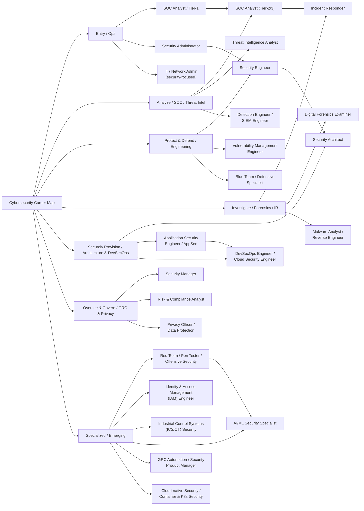

## Socials:
  

## Tech Stack:
                                   

## GitHub Stats:
 
 

### Top Contributed Repo

---

```mermaid

flowchart LR
    A[Cybersecurity Career Map]

    %% Main Categories
    A --> B1["Entry / Ops"]
    A --> B2["Analyze / SOC / Threat Intel"]
    A --> B3["Protect & Defend / Engineering"]
    A --> B4["Investigate / Forensics / IR"]
    A --> B5["Securely Provision / Architecture & DevSecOps"]
    A --> B6["Oversee & Govern / GRC & Privacy"]
    A --> B7[Specialized / Emerging]

    %% Entry / Ops
    B1 --> E1["SOC Analyst / Tier-1"]
    B1 --> E2[Security Administrator]
    B1 --> E3["IT / Network Admin<br>(security-focused)"]

    %% Analyze / SOC / Threat Intel
    B2 --> A1["SOC Analyst (Tier-2/3)"]
    B2 --> A2[Threat Intelligence Analyst]
    B2 --> A3["Detection Engineer /<br>SIEM Engineer"]

    %% Protect & Defend
    B3 --> P1[Security Engineer]
    B3 --> P2["Vulnerability Management<br>Engineer"]
    B3 --> P3["Blue Team / Defensive<br>Specialist"]

    %% Investigate / Forensics / IR
    B4 --> I1[Incident Responder]
    B4 --> I2[Digital Forensics Examiner]
    B4 --> I3["Malware Analyst /<br>Reverse Engineer"]

    %% Securely Provision
    B5 --> S1[Security Architect]
    B5 --> S2["Application Security<br>Engineer / AppSec"]
    B5 --> S3["DevSecOps Engineer /<br>Cloud Security Engineer"]

    %% Oversee & Govern
    B6 --> G1[Security Manager]
    B6 --> G2[Risk & Compliance Analyst]
    B6 --> G3["Privacy Officer /<br>Data Protection"]

    %% Specialized / Emerging
    B7 --> X1["Red Team / Pen Tester /<br>Offensive Security"]
    B7 --> X2["Identity & Access Management<br>(IAM) Engineer"]
    B7 --> X3["Industrial Control Systems<br>(ICS/OT) Security"]
    B7 --> X4[AI/ML Security Specialist]
    B7 --> X5["GRC Automation / Security<br>Product Manager"]
    B7 --> X6["Cloud-native Security /<br>Container & K8s Security"]

    %% Career Flow
    E1 --> A1
    E2 --> P1
    P1 --> S1
    A1 --> I1
    X1 --> X4
    S2 --> S3
```
